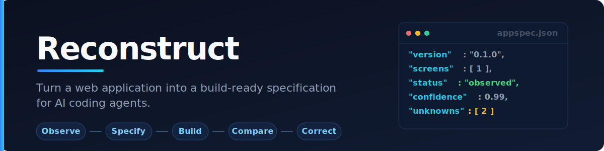
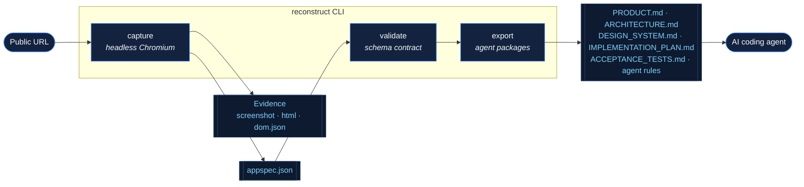
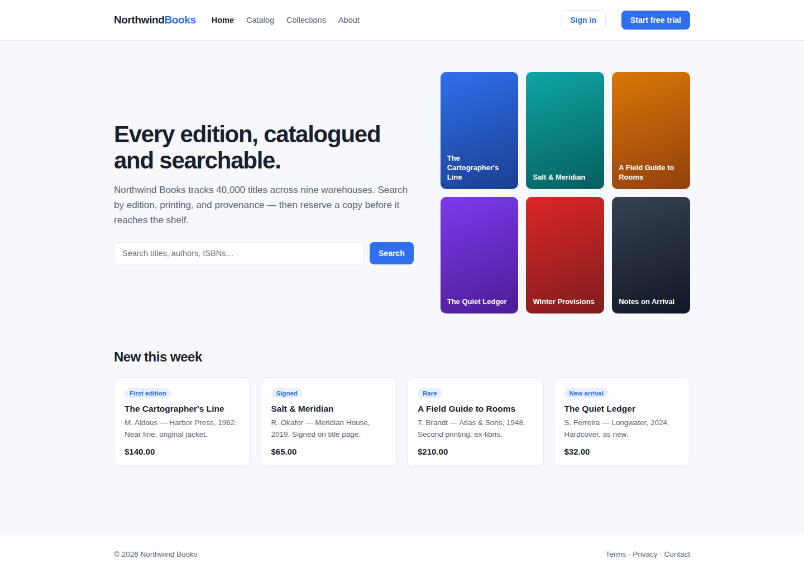
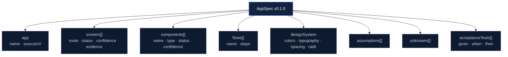
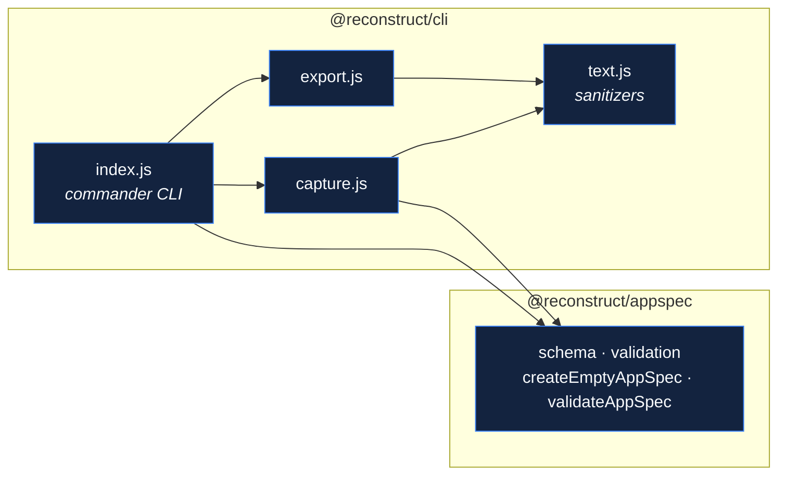

<p align="center">
  
</p>

<p align="center">
  <a href="https://github.com/XioAISolutions/Reconstruct/actions/workflows/ci.yml"></a>
  = 20">
  
  
</p>

<p align="center">
  <b>Reconstruct captures observable product evidence, converts it into a neutral <code>AppSpec</code>, and exports focused implementation packages for Cursor, Claude Code, Codex, and other coding agents.</b>
</p>

---

## Contents

- [Why Reconstruct](#why-reconstruct)
- [How it works](#how-it-works)
- [See it in action](#see-it-in-action)
- [Quick start](#quick-start)
- [Commands](#commands)
- [The AppSpec](#the-appspec)
- [Export targets](#export-targets)
- [Architecture](#architecture)
- [Trust &amp; hardening](#trust--hardening)
- [Responsible use](#responsible-use)
- [Contributing](#contributing)
- [License](#license)

---

## Why Reconstruct

Handing a live URL to a coding agent and saying *"rebuild this"* produces confident guesses. The agent cannot tell what it **saw** from what it **assumed**, so invented data models and imagined auth rules land in your codebase looking exactly like facts.

Reconstruct puts a **contract** between the page and the agent. It records only what is observable, labels every finding with a provenance status and a confidence score, keeps the raw evidence beside the specification, and lists what remains **unknown** instead of papering over it.

> **Observe → Specify → Build → Compare → Correct**

| Without Reconstruct | With Reconstruct |
| --- | --- |
| Agent guesses structure from a screenshot | Agent builds from a validated `AppSpec` |
| Assumptions look identical to facts | Every finding is `observed`, `inferred`, or `unknown` |
| Evidence is thrown away after the prompt | Screenshots, HTML, and DOM JSON are preserved |
| Unknowns are silently invented | Unknowns are first-class output |

---

## How it works



1. **Capture** loads the page in headless Chromium, waits for the network to settle, and records the screenshot, rendered HTML, and a structured DOM snapshot (links, buttons, forms, landmarks).
2. **Specify** distills that evidence into `appspec.json` — a provider-neutral document where every screen and component carries a `status` and `confidence`, with paths back to the evidence that justifies it.
3. **Validate** enforces the schema contract so a malformed spec fails loudly instead of corrupting downstream output.
4. **Export** renders the spec into focused Markdown packages plus agent-specific rule files.

---

## See it in action

Running `reconstruct capture` against a demo bookstore produces this screenshot as evidence — captured by the tool itself, not staged:

<p align="center">
  
</p>

The same run writes `appspec.json`. Note the provenance: the screen is `observed` at `0.99`, and the two things a public capture genuinely cannot know are recorded as `unknowns` rather than guessed:

```jsonc
{
  "version": "0.1.0",
  "generatedAt": "2026-07-03T00:16:02.165Z",
  "app": { "name": "Northwind Books", "sourceUrl": "https://…/" },
  "screens": [
    {
      "id": "screen-home",
      "route": "/",
      "title": "Northwind Books",
      "status": "observed",
      "confidence": 0.99,
      "evidence": [
        "evidence/screenshots/home.png",
        "evidence/pages/home.html",
        "evidence/pages/home.json"
      ]
    }
  ],
  "components": [
    { "id": "component-header-1", "name": "header-1", "type": "header", "status": "observed", "confidence": 0.9 },
    { "id": "component-nav-2",    "name": "nav-2",    "type": "nav",    "status": "observed", "confidence": 0.9 },
    { "id": "component-main-3",   "name": "main-3",   "type": "main",   "status": "observed", "confidence": 0.9 }
  ],
  "unknowns": [
    "Backend data model is not observable from a public page capture.",
    "Authorization rules require additional authorized evidence."
  ]
}
```

`reconstruct export` then turns that into agent-ready docs. For example, `PRODUCT.md`:

```markdown
# Product specification

## Product

**Northwind Books**

## Screens

- `/` — Northwind Books (observed, 99%)

## Unknowns

- Backend data model is not observable from a public page capture.
- Authorization rules require additional authorized evidence.
```

---

## Quick start

**Requirements:** Node.js ≥ 20 and [pnpm](https://pnpm.io) 9.

```bash
pnpm install
pnpm exec playwright install chromium   # one-time browser download
pnpm build

# Capture → validate → export
node run.js capture https://example.com --out ./example-reconstruction
node run.js validate ./example-reconstruction/appspec.json
node run.js export   ./example-reconstruction/appspec.json --target cursor
```

The export lands next to your capture in `exports/<target>/`, ready to drop into an agent's context.

---

## Commands

### `capture <url>`

Loads a public page and writes evidence plus `appspec.json`.

| Option | Default | Description |
| --- | --- | --- |
| `-o, --out <directory>` | `.reconstruct` | Output directory for evidence and the spec |
| `--width <pixels>` | `1440` | Viewport width (integer, 320–7680) |
| `--height <pixels>` | `1000` | Viewport height (integer, 320–7680) |
| `--timeout <milliseconds>` | `30000` | Navigation timeout (1000–300000) |

Only `http` and `https` URLs are accepted.

### `validate <file>`

Validates an `AppSpec` against the schema contract and prints the version and app name. Exits non-zero with a precise message if the file is missing, is not JSON, or violates the schema.

### `export <file>`

Renders an `AppSpec` into a documentation package.

| Option | Description |
| --- | --- |
| `-t, --target <target>` | **Required.** One of `cursor`, `claude`, `codex`, `markdown` |
| `-o, --out <directory>` | Export directory (defaults to `<spec-dir>/exports/<target>`) |

---

## The AppSpec

`AppSpec` is the single contract between capture and every exporter. Exporters may change **presentation** but never **meaning**.



Every screen and component is tagged with a **provenance status** so an agent knows how much to trust it:

| Status | Meaning | Agent guidance |
| --- | --- | --- |
| `observed` | Directly seen in captured evidence | Reproduce faithfully |
| `inferred` | Reasoned from evidence, not seen outright | Implement, but review carefully |
| `unknown` | Not determinable from the capture | Surface — never invent |

`confidence` is a number from `0` to `1` that quantifies certainty within a status, so a low-confidence `observed` finding still reads as *look again* rather than *build blindly*.

---

## Export targets

Every target emits the five core Markdown documents; agent targets add a native rules file.

| Target | Extra file | For |
| --- | --- | --- |
| `markdown` | — | Docs only, tool-agnostic |
| `cursor` | `.cursor/rules/reconstruct.mdc` | Cursor |
| `claude` | `CLAUDE.md` | Claude Code |
| `codex` | `AGENTS.md` | Codex / agent runners |

**Core documents:** `PRODUCT.md`, `ARCHITECTURE.md`, `DESIGN_SYSTEM.md`, `IMPLEMENTATION_PLAN.md`, `ACCEPTANCE_TESTS.md`.

---

## Architecture

A small pnpm workspace with a strict one-way dependency: the CLI depends on the schema package, never the reverse.



```text
packages/
├── appspec/    # schema, types, and validation — the product contract
└── cli/        # capture, export, sanitizers, and the command-line interface
```

**Architecture rules**

1. Captured evidence remains available beside the generated specification.
2. `AppSpec` is the product contract between capture and exporters.
3. Exporters may change presentation but not meaning.
4. Unknowns are valid output and should remain visible.
5. Capture features must remain explicit and user-controlled.

---

## Trust &amp; hardening

Reconstruct turns **untrusted web content** into **instructions for a coding agent**, so the pipeline treats captured pages as hostile input:

- **Schema validation** rejects malformed specs — unknown versions, non-`http(s)` source URLs, out-of-range or non-finite confidence, duplicate screen ids, and wrong-typed collections — before any exporter runs.
- **Content sanitization** strips control, zero-width, and bidirectional-override characters (Trojan-Source style) from everything that flows into the spec and DOM evidence, while the raw HTML evidence stays verbatim for auditing.
- **Injection-resistant exports** keep captured text on a single line so a page title can't forge Markdown headings, and size code fences past any embedded backticks so captured values can't break out of a fenced block.
- **Input validation** bounds viewport and timeout options and restricts `--target` to known values, so bad input fails at the CLI rather than deep inside the browser.
- **Path containment** ensures exporters only ever write inside the chosen output directory.

CI runs on Node 20 with `--frozen-lockfile`, least-privilege permissions, and the full `test` + `typecheck` + `build` suite on every push and pull request.

---

## Responsible use

Use Reconstruct for public pages and applications you **own or are authorized to evaluate**. Respect applicable terms of service, privacy, intellectual property, and access controls. Reconstruct captures only observable, public evidence and never attempts to bypass authentication or authorization.

---

## Contributing

Contributions are welcome — see [CONTRIBUTING.md](CONTRIBUTING.md). In short: keep changes focused, add tests for schema and behaviour changes, preserve the distinction between `observed`, `inferred`, and `unknown`, and keep the `AppSpec` provider-neutral.

```bash
pnpm install
pnpm test        # unit tests across the workspace
pnpm typecheck   # syntax checks
pnpm build
```

## License

[Apache-2.0](LICENSE)
